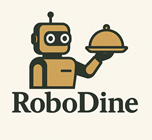
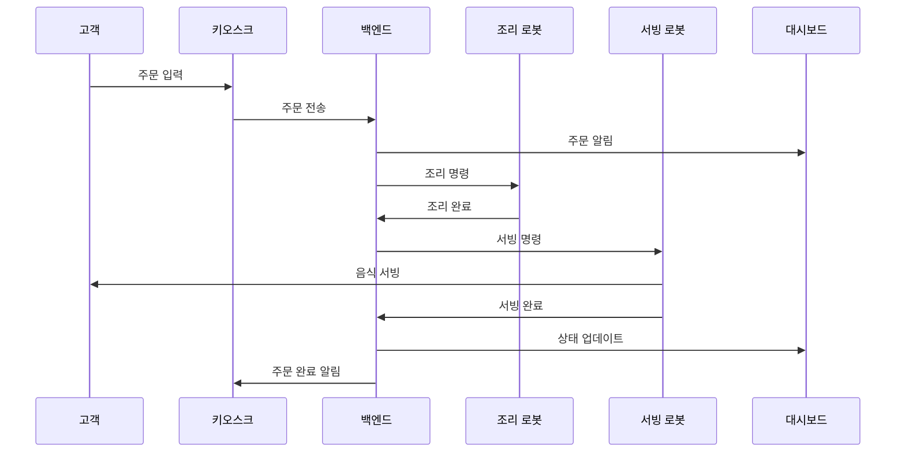

# 🤖 RoboDine - AI 기반 로봇 자동화 레스토랑 플랫폼



> *로봇과 AI가 만드는 스마트 레스토랑의 미래*

   

## 📌 프로젝트 개요

RoboDine은 로봇 기술과 인공지능을 결합한 완전 자동화된 레스토랑 서비스 플랫폼입니다. 고객 응대부터 주문 처리, 음식 조리, 서빙까지 로봇을 통해 자동화하여 효율적이고 일관된 서비스를 제공합니다.

### 🎯 주요 목표

- 로봇을 활용한 레스토랑 자동화를 통한 인건비 절감 및 서비스 효율성 향상
- 인공지능을 활용한 조리 과정 최적화 및 품질 일관성 유지
- 실시간 모니터링 및 원격 관리를 통한 매장 운영 효율성 증대
- 고객 경험 향상을 위한 직관적인 인터페이스 및 서비스 제공

## 💻 기술 스택

| 영역 | 기술 |
|-----|-----|
| **백엔드** | Python, FastAPI, SQLModel, WebSocket, RTSP |
| **프론트엔드** | React.js, Tailwind CSS, Chart.js, Socket.io-client |
| **로봇 제어** | ROS2 Jazzy, PyRobots, myCobot SDK |
| **AI & 비전** | PyTorch, OpenCV, TensorRT, YOLOv8 |
| **통신** | WebSocket, TCP, UDP, REST API, RTSP |
| **데이터베이스** | SQLite (개발), PostgreSQL (프로덕션) |
| **개발 도구** | Docker, Git, GitHub Actions, Pytest, Jest |

## 🏗️ 시스템 구성

RoboDine 시스템은 다음 핵심 모듈로 구성됩니다:

1. **[RoboDine Service](/robodine_service)** - 중앙 서버 시스템
   - [백엔드 서비스](/robodine_service/backend) - FastAPI 기반 API 서버
   - [프론트엔드 시스템](/robodine_service/frontend) - React 기반 UI
     - [운영자 대시보드](/robodine_service/frontend/operator) - 매장 관리 인터페이스
     - [키오스크 시스템](/robodine_service/frontend/kiosk) - 고객 주문 인터페이스

2. **[Alba Planner](/alba_planner)** - 서빙 로봇(Pinky) 제어 시스템
   - 고객 안내 서비스
   - 음식 서빙 서비스
   - 테이블 관리

3. **[Cook Planner](/cook_planner)** - 조리 로봇(myCobot280) 제어 시스템
   - 조리 작업 관리
   - 조리 과정 최적화
   - 안전 제어

4. **[CookGPT](/cook_gpt)** - AI 기반 조리 지원 및 비전 시스템
   - 컴퓨터 비전 기반 재료 인식
   - 위치 추정 및 로봇 제어 보조

## 📊 시스템 아키텍처

시스템의 주요 구성 요소와 상호작용을 보여주는 아키텍처 다이어그램입니다:

```mermaid
graph TB
    A[고객] --> B[키오스크 시스템]
    A --> C[서빙 로봇<br>고객 응대 & 안내]
    
    subgraph "중앙 서버 시스템"
        D[RoboDine 백엔드<br>FastAPI] <--> E[데이터베이스]
        D <--> F[WebSocket 서비스]
        D <--> G[비디오 스트리밍]
    end
    
    subgraph "로봇 제어 시스템"
        H[Alba Planner<br>서빙 로봇 제어] <--> I[서빙 로봇(Pinky)]
        J[Cook Planner<br>조리 로봇 제어] <--> K[조리 로봇(myCobot)]
    end
    
    subgraph "AI 처리 시스템"
        L[CookGPT<br>조리 지원 AI] <--> M[컴퓨터 비전<br>객체 인식]
    end
    
    B --> D
    C <--> D
    D <--> H
    D <--> J
    D <--> N[운영자 대시보드]
    J <--> L
```

자세한 아키텍처 내용은 다음 문서를 참조하세요:
- [전체 시스템 아키텍처](docs/architecture.md)
- [프로젝트 구조 개요](docs/project_structure.md)
- [FastAPI 아키텍처](docs/fastapi_architecture.md)
- [WebSocket 아키텍처](docs/websocket_architecture.md)
- [네트워크 통신](docs/network_communication.md)

## ✨ 주요 기능

### 🤖 로봇 서빙 시스템
- **주문 서빙**: 주문된 음식을 정확한 테이블로 서빙
- **테이블 관리**: 테이블 상태 모니터링 및 고객 그룹 관리
- **자율 주행**: 장애물 회피 및 최적 경로 계산
- **배터리 관리**: 자동 충전 스테이션 복귀

### 👨‍🍳 로봇 조리 시스템
- **정밀 조리 작업**: 6축 로봇 팔을 활용한 정확한 조리 작업
- **레시피 해석**: 표준화된 레시피 단계별 실행
- **조리 상태 모니터링**: 컴퓨터 비전 기반 위치 상태 확인
- **다중 주문 처리**: 여러 주문의 효율적 병렬 처리
- **안전 제어**: 안전 프로토콜에 따른 로봇 작동 관리

### 💼 매장 관리 시스템
- **실시간 모니터링**: 로봇, 주문, 테이블 등 매장 상태 실시간 모니터링
- **재고 관리**: 자동화된 재고 추적 및 발주 시스템
- **이벤트 처리**: 비상 상황 및 이벤트 실시간 처리
- **데이터 분석**: 운영 데이터 시각화 및 인사이트 제공
- **비디오 관제**: 로봇 카메라 및 매장 CCTV 통합 모니터링

### 📱 고객 인터페이스
- **키오스크 주문**: 직관적인 터치스크린 기반 메뉴 주문 시스템
- **실시간 상태 추적**: 주문 상태 실시간 업데이트
- **다국어 지원**: 한국어, 영어, 중국어, 일본어 지원
- **결제 시스템**: 다양한 결제 방식 지원 (신용카드, 모바일 결제 등)

## 🔄 데이터 흐름

시스템 내 주요 데이터 흐름을 보여주는 다이어그램입니다:



## 🖥️ 사용자 인터페이스

### 운영자 대시보드

운영자 대시보드는 매장 운영을 위한 중앙 관제 시스템으로, 다음과 같은 주요 화면으로 구성됩니다:

1. **메인 대시보드**: 전체 매장 상태 요약 및 핵심 지표 표시
2. **로봇 관리**: 로봇 상태 모니터링 및 원격 제어
3. **주문 관리**: 주문 접수, 상태 변경, 이력 관리
4. **재고 관리**: 실시간 재고 현황 및 발주 관리
5. **고객/테이블 관리**: 테이블 상태 및 고객 그룹 관리
6. **비디오 모니터링**: 로봇 카메라 및 매장 CCTV 관제
7. **시스템 설정**: 시스템 파라미터 및 사용자 관리

### 키오스크 시스템

고객이 직접 주문할 수 있는 키오스크 시스템은 다음과 같은 화면으로 구성됩니다:

1. **시작 화면**: 언어 선택 및 테이블 번호 입력
2. **메뉴 탐색**: 카테고리별 메뉴 브라우징
3. **상세 메뉴**: 메뉴 상세 정보 및 옵션 선택
4. **장바구니**: 선택된 메뉴 관리 및 수량 조절
5. **결제 화면**: 주문 확인 및 결제 처리
6. **주문 상태**: 주문 접수 확인 및 진행 상태 표시

## 🔧 개발 환경 및 설정

### 개발 환경 요구사항

- Python 3.8+
- Node.js 14+
- ROS2 Jazzy
- CUDA 11.4+ (AI 모듈용)
- PostgreSQL 13+ (프로덕션)


## 🧪 테스트 및 품질 관리

- **단위 테스트**: 개별 모듈 및 함수 테스트
- **통합 테스트**: 모듈 간 상호작용 검증
- **시스템 테스트**: 전체 시스템 기능 검증
- **부하 테스트**: 고부하 상황에서 성능 측정
- **사용성 테스트**: 실제 사용자 피드백 수집

## 🌟 미래 발전 계획

- **AI 주문 추천 시스템**: 고객 선호도 기반 개인화된 메뉴 추천
- **음성 인식 주문**: 음성 명령을 통한 주문 처리
- **다중 매장 관리**: 중앙화된 다중 매장 관리 및 데이터 분석
- **로봇 협업 고도화**: 서빙 및 조리 로봇 간 더 높은 수준의 협업


## 👥 개발팀

- 김용규(팀장) - 조리 로봇 제어
- 김인수 - 통신 및 웹 프론트엔드
- 임지혜 - AI 및 비전 시스템
- 장성원 - AI 및 비전 시스템
- 심경용 - 서빙 로봇 제어
- 허은재 - 서빙 로봇 제어


