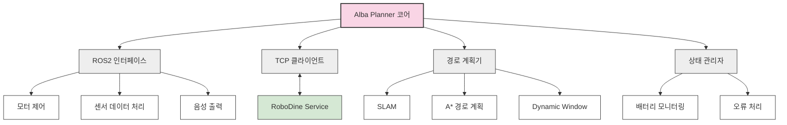

# 🤖 Alba Planner - 서빙 로봇 제어 시스템

   

## 📌 개요

Alba Planner는 RoboDine 자동화 레스토랑의 서빙 로봇(Pinky)을 제어하는 핵심 시스템입니다. 고객 인식, 테이블 안내, 음식 서빙, 이동 경로 계획, 장애물 회피 등 서빙 로봇의 모든 기능을 담당하며 중앙 서버(RoboDine Service)와 TCP 통신을 통해 연동됩니다.

<div align="center">
  
</div>

## ✨ 주요 기능

### 🧭 고객 응대 및 안내
- **고객 인식 및 인사**: 출입구에서 고객을 감지하고 인사말 재생
- **테이블 안내**: 예약 정보 또는 빈 테이블로 고객 안내
- **QR코드 안내**: 테이블별 QR코드 안내 및 메뉴 접근 지원
- **대기 안내**: 만석 시 대기 시스템 안내

### 🍽️ 음식 서빙
- **주문 수령**: 주방에서 조리 완료된 음식 수령
- **정확한 테이블 서빙**: 목적지 테이블까지 음식 배달
- **다중 테이블 서빙**: 단일 이동으로 여러 테이블 동시 서빙
- **완료 알림**: 서빙 완료 후 중앙 시스템에 상태 업데이트

### 🚶 이동 및 경로 계획
- **실시간 경로 계획**: 매장 레이아웃 기반 최적 경로 계산
- **장애물 감지 및 회피**: LiDAR 센서를 통한 동적 장애물 감지
- **충돌 방지**: 안전 거리 유지 및 비상 정지 기능

### 🆘 비상 대응
- **화재 감지**: 화재 경보 시 고객 대피 안내
- **시스템 오류**: 하드웨어/소프트웨어 오류 시 안전 모드 전환
- **배터리 관리**: 저전력 감지 및 자동 충전 스테이션 복귀

## 🏗️ 시스템 아키텍처

Alba Planner는 ROS2(Robot Operating System 2) 기반으로 구축되어 있으며, 다음과 같은 구성 요소로 이루어져 있습니다:



## 📁 디렉토리 구조

```
alba_planner/
├── alba_manager/
│   ├── __init__.py
│   ├── main.py              # 메인 실행 파일
│   ├── config.py            # 설정 관리
│   ├── ros2_interface.py    # ROS2 연동 인터페이스
│   ├── tcp_client.py        # 중앙 서버 통신 클라이언트
│   ├── path_planner.py      # 경로 계획 알고리즘
│   ├── robot_state.py       # 로봇 상태 관리
│   ├── speech_manager.py    # 음성 안내 관리
│   ├── customer_detector.py # 고객 감지 모듈
│   └── battery_monitor.py   # 배터리 모니터링
├── launch/
│   └── alba_planner.launch.py  # ROS2 실행 파일
├── msg/
│   ├── RobotState.msg       # 로봇 상태 메시지 정의
│   └── NavigationGoal.msg   # 네비게이션 목표 메시지 정의
├── config/
│   ├── robot_params.yaml    # 로봇 파라미터 설정
│   └── map.yaml             # 맵 설정
├── tests/
│   ├── test_path_planner.py # 경로 계획 테스트
│   └── test_tcp_client.py   # TCP 클라이언트 테스트
└── setup.py                 # ROS2 패키지 설정
```

## 💻 기술 스택

- **ROS2 Jazzy**: 로봇 운영 체제 프레임워크
- **Python 3.8+**: 핵심 로직 구현 언어
- **PyRobot**: 로봇 제어 라이브러리
- **OpenCV**: 이미지 처리 및 객체 인식
- **NumPy**: 수치 계산 및 경로 알고리즘
- **TCP Socket**: 중앙 서버와의 통신
- **SLAM 알고리즘**: 동시적 위치추정 및 지도작성
- **A* & Dynamic Window**: 경로 계획 알고리즘

## 🔄 통신 프로토콜

Alba Planner는 다음과 같은 통신 방식으로 다른 시스템과 연동됩니다:

| 연결 대상 | 프로토콜 | 포트 | 내용 |
|---------|---------|-----|------|
| RoboDine Service | TCP | 8001 | 명령 수신 및 상태 보고 |
| ROS2 토픽 | - | - | 센서 데이터 및 액추에이터 제어 |
| 내부 로봇 하드웨어 | Serial | - | 모터, 센서 직접 제어 |

### TCP 메시지 형식

```json
{
  "type": "command",
  "action": "move_to_table",
  "params": {
    "table_id": 5,
    "priority": "high"
  }
}
```

## 🚀 실행 방법

### 필수 요구사항

- ROS2 Jazzy
- Python 3.8+
- 필요 패키지 설치

### 설치 및 실행

1. ROS2 워크스페이스에 Alba Planner 클론:

```bash
cd ~/ros2_ws/src/
git clone https://github.com/yourusername/robodine-project.git
```

2. 의존성 설치:

```bash
cd ~/ros2_ws
rosdep install --from-paths src --ignore-src -r -y
```

3. 빌드:

```bash
colcon build --packages-select alba_planner
```

4. 실행:

```bash
source ~/ros2_ws/install/setup.bash
ros2 launch alba_planner alba_planner.launch.py
```

## 📊 성능 및 제한사항

- **최대 이동 속도**: 1.2 m/s
- **배터리 지속 시간**: 약 8시간 (연속 사용)
- **적재 용량**: 최대 5kg (약 3개 테이블 동시 서빙)
- **네비게이션 정확도**: ±5cm
- **장애물 감지 거리**: 최대 5m
- **지원 언어**: 한국어, 영어, 중국어, 일본어

## 🧪 테스트

Alba Planner는 다양한 테스트를 통해 안정성을 검증합니다:

- **단위 테스트**: 개별 모듈 기능 테스트
- **통합 테스트**: ROS2 인터페이스 및 TCP 통신 테스트
- **시뮬레이션 테스트**: Gazebo를 이용한 가상 환경 테스트
- **현장 테스트**: 실제 레스토랑 환경에서의 안정성 검증

테스트 실행:

```bash
cd ~/ros2_ws
colcon test --packages-select alba_planner
```

## 🔧 문제 해결

일반적인 문제 및 해결 방법:

- **연결 문제**: TCP 연결 실패 시 자동 재연결 시도 (최대 5회)
- **경로 계획 실패**: 대체 경로 계산 또는 원격 도움 요청
- **센서 오류**: 보조 센서 활성화 및 저감도 모드 전환
- **모터 과열**: 자동 냉각 모드 및 부하 감소

## 🔮 향후 개발 계획

- **다중 로봇 협업**: 여러 서빙 로봇 간 작업 분배 및 협업
- **고급 상호작용**: 자연어 처리를 통한 고객 질문 응답
- **자율 충전**: 완전 자율적인 충전 스테이션 도킹
- **얼굴 인식**: 단골 고객 인식 및 맞춤 서비스
- **감정 인식**: 고객 감정 인식을 통한 서비스 최적화

## 📚 참고 자료

- [ROS2 공식 문서](https://docs.ros.org/en/jazzy/index.html)
- [Pinky 로봇 사용자 매뉴얼](../docs/robot_manuals/pinky_manual.pdf)
- [SLAM 알고리즘 구현 가이드](../docs/technical/slam_implementation.md)
- [네비게이션 스택 설정](../docs/technical/navigation_setup.md) 