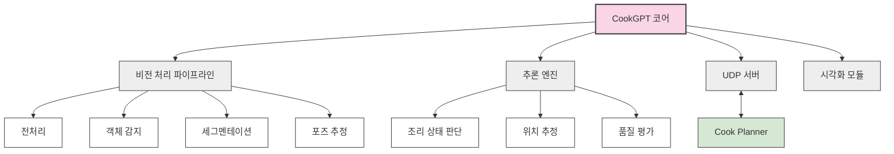

# 🧠 CookGPT - AI 기반 조리 지원 시스템

     

## 📌 개요

CookGPT는 RoboDine 자동화 레스토랑의 AI 기반 조리 지원 시스템입니다. 컴퓨터 비전과 딥러닝 기술을 활용하여 조리 로봇(myCobot280)에게 실시간 피드백과 가이드를 제공합니다. 식재료 인식, 조리 상태 판단, 로봇 위치 추정 및 보정 등 지능적인 결정을 통해 일관된 고품질의 요리 생산을 지원합니다.

<div align="center">
  
</div>

## ✨ 주요 기능

### 🔍 컴퓨터 비전 처리
- **식재료 인식**: 다양한 식재료 종류 식별
- **위치 추정**: 작업 공간 내 재료의 정확한 3D 위치 계산

### 🤖 로봇 움직임 지원
- **시각적 서보잉**: 카메라 피드백 기반 로봇 팔 위치 보정
- **물체 파지점 계산**: 최적의 파지 위치 및 방향 제안
- **동작 검증**: 로봇 동작의 정확성 및 안전성 확인

### 🧪 조리 결정 지원
- **조리 시간 최적화**: 재료 상태에 따른 최적 조리 시간 계산
- **이상 상황 감지**: 조리 과정의 이상 징후 조기 감지 및 경고

### 🌐 통합 시스템
- **UDP 기반 통신**: Cook Planner와의 저지연 통신
- **비동기 처리**: 다중 요청 병렬 처리 지원
- **결과 시각화**: 디버깅 및 모니터링을 위한 처리 결과 시각화
- **로깅 및 분석**: 모든 판단 과정과 결과의 상세 기록

## 🏗️ 시스템 아키텍처

CookGPT는 모듈식 설계로 구성되어 있어 유연한 확장이 가능합니다:



## 📁 디렉토리 구조

```
cook_gpt/
├── cookgpt_service/
│   ├── __init__.py
│   ├── main.py              # 메인 실행 파일
│   ├── config.py            # 설정 관리
│   ├── udp_server.py        # UDP 통신 인터페이스
│   ├── inference.py         # 모델 추론 모듈
│   ├── object_detection.py  # 객체 감지 모듈
│   ├── segmentation.py      # 세그멘테이션 모듈
│   ├── pose_estimation.py   # 포즈 추정 모듈
│   ├── visual_servoing.py   # 시각적 서보잉 모듈
│   ├── quality_check.py     # 품질 평가 모듈
│   └── visualization.py     # 결과 시각화 도구
├── models/
│   ├── detection/           # 객체 감지 모델
│   ├── segmentation/        # 세그멘테이션 모델
│   ├── pose/                # 포즈 추정 모델
│   └── quality/             # 품질 평가 모델
├── utils/
│   ├── image_processing.py  # 이미지 처리 유틸리티
│   ├── calibration.py       # 카메라 캘리브레이션 도구
│   └── metrics.py           # 평가 메트릭스
├── data/
│   ├── training/            # 학습 데이터셋
│   ├── validation/          # 검증 데이터셋
│   └── camera_params/       # 카메라 캘리브레이션 파라미터
├── tests/
│   ├── test_detection.py    # 객체 감지 테스트
│   ├── test_inference.py    # 추론 엔진 테스트
│   └── test_udp_server.py   # UDP 서버 테스트
└── requirements.txt         # 의존성 패키지 목록
```

## 💻 기술 스택

- **Python 3.8+**: 핵심 로직 구현 언어
- **PyTorch**: 딥러닝 모델 학습 및 추론
- **TensorRT**: 모델 최적화 및 가속화
- **OpenCV**: 이미지 처리 및 컴퓨터 비전
- **CUDA**: GPU 기반 병렬 처리
- **YOLOv8**: 객체 감지
- **DeepLabV3+**: 시맨틱 세그멘테이션
- **Mediapipe**: 포즈 추정
- **UDP Socket**: 저지연 통신
- **NumPy/SciPy**: 수치 계산 및 데이터 처리

## 🔄 통신 프로토콜

CookGPT는 UDP 프로토콜을 통해 Cook Planner와 저지연 통신을 수행합니다:

| 메시지 유형 | 방향 | 설명 |
|----------|------|------|
| vision_request | Cook Planner → CookGPT | 비전 처리 요청 (이미지 분석, 상태 확인 등) |
| vision_response | CookGPT → Cook Planner | 비전 처리 결과 (좌표, 상태, 조언 등) |
| calibration_request | Cook Planner → CookGPT | 카메라 캘리브레이션 요청 |
| error_notification | CookGPT → Cook Planner | 오류 상황 알림 |

### 요청 메시지 예시
```json
{
  "id": "REQ12345",
  "type": "vision_request",
  "task": "detect_doneness",
  "image_data": "base64_encoded_image_data",
  "parameters": {
    "target": "beef_patty",
    "expected_state": "medium_rare",
    "threshold": 0.85
  },
  "timestamp": 1643542800
}
```

### 응답 메시지 예시
```json
{
  "id": "REQ12345",
  "type": "vision_response",
  "task": "detect_doneness",
  "results": {
    "state": "medium_rare",
    "confidence": 0.92,
    "cooking_time_remaining": 15,
    "recommendations": ["Flip in 10 seconds", "Reduce heat by 5%"]
  },
  "processing_time": 0.12,
  "timestamp": 1643542800
}
```

## 📊 모델 아키텍처 및 성능

CookGPT는 다양한 컴퓨터 비전 모델을 활용하여 정확한 판단을 제공합니다:

### 객체 감지 (YOLOv8)
- **아키텍처**: YOLOv8-m (중간 크기 모델)
- **추론 속도**: ~20ms/프레임 (NVIDIA RTX 3080)
- **mAP@0.5**: 94.8% (식재료 클래스)
- **클래스 수**: 5개 (식재료, 조리된 음식)

### 포즈 추정
- **아키텍처**: 커스텀 CNN + 공간 트랜스포머
- **추론 속도**: ~15ms/프레임
- **위치 정확도**: ±3mm
- **회전 정확도**: ±2도


## 📊 성능 벤치마크

### 판단 정확도

| 작업 | 정확도 | 기준 |
|------|--------|------|
| 재료 인식 | 97.8% | 클래스별 정확도 |
| 위치 추정 | ±3mm | 3D 공간 오차 |

## 📈 개선 및 최적화

CookGPT는 지속적인 성능 향상을 위해 다음과 같은 최적화 기법을 적용했습니다:

- **GPU 메모리 최적화**: 배치 처리 및 메모리 효율적 연산
- **파이프라인 병렬화**: 비전 처리 단계 병렬 실행
- **데이터 증강**: 다양한 조명, 각도 조건에서의 강건성 향상

## 🔮 향후 개발 계획

## 🧪 시스템 테스트

CookGPT는 다음과 같은 테스트를 통해 안정성을 검증합니다:

- **단위 테스트**: 각 모듈별 기능 검증
- **통합 테스트**: 전체 파이프라인 동작 검증
- **정확도 테스트**: 다양한 환경/조건에서의 판단 정확도 측정
- **견고성 테스트**: 노이즈, 가려짐 등 불리한 조건에서의 동작 검증

테스트 실행:
```bash
pytest tests/
```

## 📚 참고 자료

- [YOLOv8 공식 문서](https://docs.ultralytics.com/)