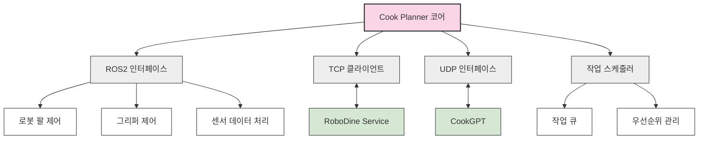

# 🍳 Cook Planner - 조리 로봇 제어 시스템

    

## 📌 개요

Cook Planner는 RoboDine 자동화 레스토랑의 조리 로봇(myCobot280)을 제어하는 지능형 시스템입니다. 음식 조리 계획, 로봇 움직임 제어, 조리 과정 모니터링 및 최적화를 담당하며, AI 지원 시스템(CookGPT)과 연동하여 고품질의 일관된 조리 결과를 보장합니다. 중앙 서버(RoboDine Service)와 TCP 통신, CookGPT와는 UDP 통신을 통해 효율적으로 연동됩니다.

<div align="center">
  
</div>

## ✨ 주요 기능

### 🔪 조리 워크플로우 관리
- **레시피 해석**: 표준화된 레시피 포맷 해석 및 실행 단계 계획
- **준비 작업**: 필요한 재료 및 도구 준비
- **조리 순서 최적화**: 다중 주문 병렬 처리 최적화
- **조리 진행도 모니터링**: 각 단계별 진행도 추적 및 보고

### 🦾 로봇 제어
- **정밀 움직임 제어**: 6축 로봇 팔의 정확한 움직임 제어
- **도구 조작**: 다양한 조리 도구 사용
- **힘 제어**: 적절한 힘으로 재료 조작

### 👁️ 비전 시스템 연동
- **재료 인식**: CookGPT와 연동하여 재료 위치 및 상태 파악
- **위치 보정**: 비전 기반 로봇 위치 보정

### 🧪 특수 기능
- **다중 요리 관리**: 여러 요리의 동시 조리 관리

## 🏗️ 시스템 아키텍처

Cook Planner는 모듈식 아키텍처로 설계되어 있어 유연한 확장이 가능합니다:



## 📁 디렉토리 구조

```
cook_planner/
├── cook_manager/
│   ├── __init__.py
│   ├── main.py              # 메인 실행 파일
│   ├── config.py            # 설정 관리
│   ├── ros2_interface.py    # ROS2 연동 인터페이스
│   ├── tcp_client.py        # 중앙 서버 통신 클라이언트
│   ├── udp_interface.py     # CookGPT 통신 인터페이스
│   ├── robot_control.py     # 로봇 제어 로직
│   ├── task_scheduler.py    # 작업 스케줄링
│   ├── recipe_parser.py     # 레시피 해석 모듈
│   ├── cooking_tasks.py     # 기본 조리 작업 정의
│   └── sensor_monitor.py    # 센서 모니터링
├── launch/
│   └── cook_planner.launch.py  # ROS2 실행 파일
├── msg/
│   ├── CookingTask.msg      # 조리 작업 메시지 정의
│   └── RobotState.msg       # 로봇 상태 메시지 정의
├── config/
│   ├── robot_params.yaml    # 로봇 파라미터 설정
│   └── recipes/             # 레시피 정의 파일들
├── tests/
│   ├── test_robot_control.py # 로봇 제어 테스트
│   └── test_recipe_parser.py # 레시피 파서 테스트
└── setup.py                 # ROS2 패키지 설정
```

## 💻 기술 스택

- **ROS2 Jazzy**: 로봇 운영 체제 프레임워크
- **Python 3.8+**: 핵심 로직 구현 언어
- **myCobot280 SDK**: 로봇 하드웨어 제어
- **NumPy**: 기구학 계산 및 궤적 생성
- **Scipy**: 최적화 알고리즘
- **TCP/UDP Socket**: 외부 시스템 통신
- **JSON**: 데이터 직렬화 및 레시피 포맷
- **Concurrent.futures**: 병렬 작업 처리

## 🔄 통신 프로토콜

Cook Planner는 다양한 통신 채널을 통해 외부 시스템과 연동됩니다:

| 연결 대상 | 프로토콜 | 포트 | 내용 |
|---------|---------|-----|------|
| RoboDine Service | TCP | 8002 | 주문 수신 및 상태 보고 |
| CookGPT | UDP | 8003 | 비전 데이터 수신 및 분석 요청 |
| ROS2 토픽 | - | - | 로봇 제어 및 센서 데이터 |
| 내부 하드웨어 | Serial | - | 로봇 직접 제어 및 센서 읽기 |

### TCP 메시지 예시 (RoboDine Service → Cook Planner)

```json
{
  "type": "cooking_order",
  "order_id": "ORD12345",
  "recipes": [
    {
      "recipe_id": "RECIPE001",
      "name": "비빔밥",
      "quantity": 2,
      "modifications": [
        {"ingredient": "고추장", "action": "reduce", "amount": "30%"}
      ],
      "priority": "high"
    }
  ],
  "estimated_completion_time": "300"
}
```

### UDP 메시지 예시 (Cook Planner → CookGPT)

```json
{
  "type": "vision_request",
  "task_id": "TSK12345",
  "action": "detect_doneness",
  "target": "beef_patty",
  "camera_id": "top_cam",
  "timestamp": 1643542800
}
```

## 🧪 조리 작업 정의

Cook Planner는 다음과 같은 기본 조리 작업들을 조합하여 복잡한 레시피를 실행합니다:

| 작업 ID | 설명 | 파라미터 |
|--------|-----|---------|
| PICK | 재료 또는 도구 집기 | 대상, 위치, 그립 강도 |
| PLACE | 재료 또는 도구 놓기 | 대상, 목표 위치, 방향 |
| SHAKING | 재료 흔들기 | 대상, 흔들기 횟수 |
| WAIT | 대기 | 시간, 조건 |
| CHECK | 상태 확인 | 대상, 기준, 카메라 ID |


## 📊 성능 및 제한사항

- **자유도**: 6축 (회전 + 그리퍼)
- **최대 도달 거리**: 280mm
- **페이로드**: 최대 250g
- **반복 정밀도**: ±0.5mm
- **작업 시간**: 평균 샐러드 제작 5분

## 🔧 문제 해결

일반적인 문제 및 해결 방법:

- **통신 지연**: 패킷 크기 최적화 및 우선순위 큐 적용
- **작업 충돌**: 충돌 감지 시 안전 정지 및 재계획

## 🧠 알고리즘

Cook Planner는 다양한 알고리즘을 활용하여 효율적인 조리 작업을 수행합니다:

- **역기구학 계산**: 목표 위치에 도달하기 위한 각 관절 각도 계산
- **경로 계획**: 충돌 없는 부드러운 로봇 움직임 생성
- **작업 스케줄링**: 다중 주문의 효율적인 처리를 위한 스케줄 최적화
- **이미지 처리**: CookGPT와 연동한 비전 기반 피드백 처리

## 🔮 향후 개발 계획

- **다중 로봇 협업**: 여러 로봇 팔의 협업을 통한 복잡한 요리 제작
- **새로운 도구 지원**: 추가 조리 도구 사용 기능 확장

## 📚 참고 자료