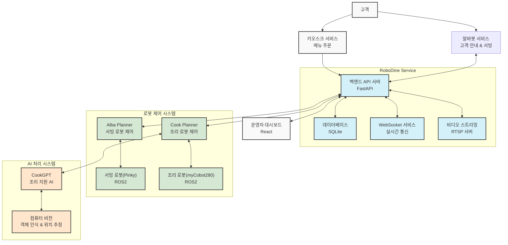

# 🏗️ RoboDine 시스템 아키텍처

## 📌 아키텍처 개요

RoboDine은 로봇 기술과 인공지능을 활용한 완전 자동화된 레스토랑 시스템으로, 고객 응대부터 주문 처리, 음식 조리, 서빙까지 전체 프로세스를 자동화합니다. 이 문서는 RoboDine 시스템의 전체 아키텍처와 구성 요소 간의 상호작용을 설명합니다.

## 🔍 아키텍처 구성도

## 🧠 주요 서브시스템

### 1. RoboDine Service (중앙 서버)

중앙 데이터 관리 및 시스템 조정을 담당하는 핵심 서브시스템입니다.

**주요 구성 요소:**
- **FastAPI 백엔드 서버**: REST API, 웹소켓, 비즈니스 로직 처리
- **SQLite 데이터베이스**: 주문, 로봇, 테이블, 재고 등의 데이터 저장
- **WebSocket 서비스**: 실시간 데이터 업데이트 제공
- **비디오 스트리밍 서버**: RTSP 프로토콜을 통한 로봇 카메라 스트림 제공

**기술 스택:**
- Python 3.8+, FastAPI, SQLModel, Socket.io, RTSP Server

### 2. 로봇 제어 시스템

로봇의 움직임과 작업을 제어하는 서브시스템입니다.

**주요 구성 요소:**
- **Alba Planner**: 서빙 로봇(Pinky) 제어 및 고객 응대 로직
- **Cook Planner**: 조리 로봇(myCobot280) 제어 및 조리 작업 관리
- **ROS2 인터페이스**: 로봇 운영 체제와의 통신 관리

**기술 스택:**
- Python 3.8+, ROS2 Jazzy, TCP/IP 통신

### 3. AI 처리 시스템

음식 인식, 위치 추정, 조리 보조를 위한 AI 기반 서브시스템입니다.

**주요 구성 요소:**
- **CookGPT**: 조리 과정 지원 및 의사결정 AI
- **컴퓨터 비전**: 음식 인식, 위치 추정, 장애물 감지
- **로봇 위치 보정**: 시각적 서보잉 기술을 활용한 정밀 위치 보정

**기술 스택:**
- Python 3.8+, PyTorch, OpenCV, UDP 통신

### 4. 프론트엔드 시스템

사용자 인터페이스를 제공하는 서브시스템입니다.

**주요 구성 요소:**
- **운영자 대시보드**: 매장 관리자를 위한 실시간 모니터링 및 제어 인터페이스
- **키오스크 UI**: 고객의 메뉴 탐색 및 주문을 위한 터치스크린 인터페이스

**기술 스택:**
- React.js, Tailwind CSS, WebSocket, Axios

## 🔄 통신 프로토콜 및 데이터 흐름

### 주요 통신 프로토콜

| 연결 지점 | 프로토콜 | 포트 | 용도 |
|----------|---------|------|------|
| RoboDine Service ↔ Alba Planner | TCP | 8001 | 서빙 로봇 명령 및 상태 |
| RoboDine Service ↔ Cook Planner | TCP | 8002 | 조리 로봇 명령 및 상태 |
| Cook Planner ↔ CookGPT | UDP | 8003 | 비전 데이터 및 AI 결과 |
| Frontend ↔ RoboDine Service | WebSocket | 3000 | 실시간 UI 업데이트 |
| Frontend ↔ RoboDine Service | HTTP/REST | 8000 | 데이터 CRUD 작업 |
| RoboDine Service → Frontend | RTSP | 8554 | 비디오 스트림 |

### 데이터 흐름 예시: 주문 처리

1. **주문 접수**
   - 고객이 키오스크 UI를 통해 주문 제출
   - REST API를 통해 RoboDine Service로 주문 데이터 전송
   - 주문 정보가 데이터베이스에 저장

2. **주방 처리**
   - RoboDine Service가 TCP를 통해 Cook Planner에 조리 명령 전송
   - Cook Planner가 UDP를 통해 CookGPT에 비전 데이터 전송
   - CookGPT가 음식 인식 및 위치 추정 후 결과 반환
   - Cook Planner가 ROS2를 통해 조리 로봇에 명령 전송

3. **서빙 처리**
   - 조리 완료 시 Cook Planner가 RoboDine Service에 알림
   - RoboDine Service가 TCP를 통해 Alba Planner에 서빙 명령 전송
   - Alba Planner가 ROS2를 통해 서빙 로봇에 명령 전송
   - 서빙 완료 시 Alba Planner가 RoboDine Service에 알림

4. **실시간 모니터링**
   - 전체 과정은 WebSocket을 통해 운영자 대시보드에 실시간 업데이트
   - 로봇 카메라 영상은 RTSP를 통해 대시보드에 스트리밍

## 🛡️ 보안 및 안정성

### 보안 측면

- **인증 및 권한**: JWT 기반 인증으로 API 및 웹소켓 접근 제어
- **데이터 보호**: HTTPS 통신 및 필요시 민감 데이터 암호화
- **로그 관리**: 모든 시스템 이벤트 및 접근 기록 저장

### 안정성 측면

- **장애 복구**: 모든 로봇 및 서버는 장애 발생 시 안전 모드로 전환
- **폴백 메커니즘**: 통신 실패 시 자동 재연결 및 대체 통신 경로 사용
- **비상 정지**: 모든 로봇에 비상 정지 기능 구현

## 🚀 확장성 및 미래 발전 계획

- **서빙 로봇 추가 용이성**: 표준화된 인터페이스로 새로운 로봇 모델 통합 가능
- **분산 시스템으로 확장**: 필요시 마이크로서비스 아키텍처로 전환 가능
- **클라우드 연동**: 데이터 분석 및 다중 지점 관리를 위한 클라우드 통합 가능

## 📊 성능 모니터링

- **시스템 지표**: CPU, 메모리, 네트워크 사용량 등 모니터링
- **로봇 지표**: 배터리 수준, 모터 온도, 이동 거리 등 추적
- **비즈니스 지표**: 주문 처리 시간, 서빙 완료율, 고객 대기 시간 등 측정

## 📋 기술 스택 요약

| 구성 요소 | 기술 스택 |
|----------|----------|
| 백엔드 | Python, FastAPI, SQLModel, Socket.io |
| 데이터베이스 | SQLite (개발), PostgreSQL (프로덕션 옵션) |
| 프론트엔드 | React.js, Tailwind CSS, Chart.js |
| 로봇 제어 | ROS2 Jazzy, Python |
| AI 및 비전 | PyTorch, OpenCV, TensorRT |
| 통신 | HTTP/REST, WebSocket, TCP/IP, UDP, RTSP |
| 배포 | Docker, GitHub Actions |
