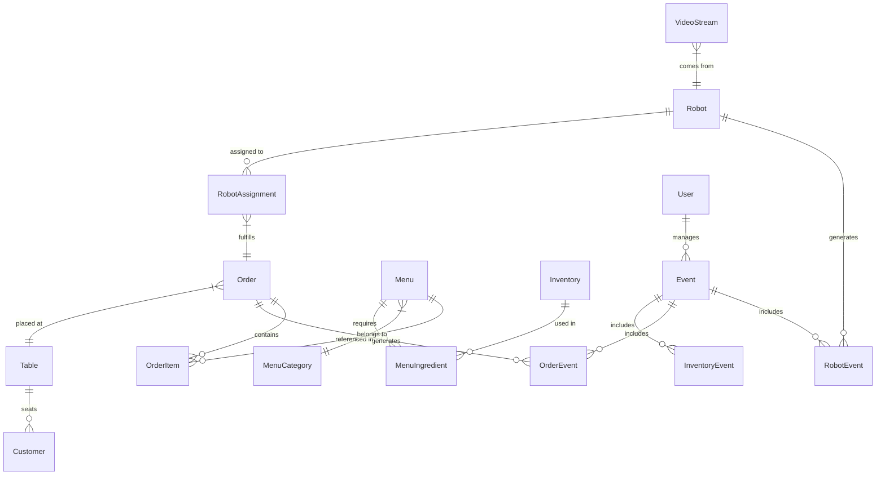

# 💾 RoboDine 데이터베이스 스키마

## 📌 개요

RoboDine 서비스는 SQLModel을 사용하여 SQLite(개발 환경) 및 PostgreSQL(프로덕션 환경)과 상호작용합니다. 이 문서는 주요 데이터 모델과 테이블 구조를 설명합니다.

## 🏗️ ER 다이어그램



## 📋 주요 테이블

### Robot

로봇 정보 및 상태를 저장하는 테이블입니다.

```python
class Robot(SQLModel, table=True):
    id: Optional[int] = Field(default=None, primary_key=True)
    robot_id: str = Field(index=True, unique=True)
    name: str
    type: EntityType  # SERVING 또는 COOKING
    mac_address: str = Field(unique=True)
    ip_address: str
    status: RobotStatus = Field(default=RobotStatus.IDLE)
    battery_level: Optional[int] = None
    location_x: Optional[float] = None
    location_y: Optional[float] = None
    last_maintenance: Optional[datetime] = None
    timestamp: datetime = Field(default_factory=datetime.now)
    
    # 관계
    events: List["RobotEvent"] = Relationship(back_populates="robot")
    assignments: List["RobotAssignment"] = Relationship(back_populates="robot")
    video_stream: Optional["VideoStream"] = Relationship(back_populates="robot")
```

| 필드명 | 타입 | 설명 |
|-------|-----|------|
| id | Integer | 기본 키 |
| robot_id | String | 로봇 고유 ID (예: "alba-001") |
| name | String | 로봇 이름 |
| type | Enum | 로봇 유형 (SERVING 또는 COOKING) |
| mac_address | String | MAC 주소 |
| ip_address | String | IP 주소 |
| status | Enum | 로봇 상태 (IDLE, BUSY, CHARGING, ERROR) |
| battery_level | Integer | 배터리 잔량 (0-100) |
| location_x | Float | X 좌표 위치 |
| location_y | Float | Y 좌표 위치 |
| last_maintenance | Datetime | 마지막 정비 날짜 |
| timestamp | Datetime | 마지막 업데이트 시간 |

### Order

고객 주문 정보를 저장하는 테이블입니다.

```python
class Order(SQLModel, table=True):
    id: Optional[int] = Field(default=None, primary_key=True)
    order_id: str = Field(index=True, unique=True, default_factory=lambda: f"ORD-{uuid.uuid4().hex[:8].upper()}")
    table_id: Optional[int] = Field(default=None, foreign_key="table.id")
    status: OrderStatus = Field(default=OrderStatus.PENDING)
    customer_count: int = Field(default=1)
    total_price: float = Field(default=0.0)
    payment_method: Optional[PaymentMethod] = None
    payment_status: PaymentStatus = Field(default=PaymentStatus.PENDING)
    created_at: datetime = Field(default_factory=datetime.now)
    updated_at: datetime = Field(default_factory=datetime.now)
    estimated_completion_time: Optional[datetime] = None
    
    # 관계
    table: Optional["Table"] = Relationship(back_populates="orders")
    items: List["OrderItem"] = Relationship(back_populates="order")
    events: List["OrderEvent"] = Relationship(back_populates="order")
    assignments: List["RobotAssignment"] = Relationship(back_populates="order")
```

| 필드명 | 타입 | 설명 |
|-------|-----|------|
| id | Integer | 기본 키 |
| order_id | String | 주문 고유 ID (예: "ORD-5A2B7F13") |
| table_id | Integer | 테이블 외래 키 |
| status | Enum | 주문 상태 (PENDING, COOKING, SERVING, COMPLETED, CANCELLED) |
| customer_count | Integer | 고객 수 |
| total_price | Float | 총 가격 |
| payment_method | Enum | 결제 방법 (CARD, CASH, MOBILE) |
| payment_status | Enum | 결제 상태 (PENDING, PAID, FAILED, REFUNDED) |
| created_at | Datetime | 주문 생성 시간 |
| updated_at | Datetime | 주문 갱신 시간 |
| estimated_completion_time | Datetime | 예상 완료 시간 |

### Table

매장 테이블 정보를 저장하는 테이블입니다.

```python
class Table(SQLModel, table=True):
    id: Optional[int] = Field(default=None, primary_key=True)
    table_number: int = Field(unique=True)
    capacity: int
    location_x: float
    location_y: float
    status: TableStatus = Field(default=TableStatus.AVAILABLE)
    updated_at: datetime = Field(default_factory=datetime.now)
    
    # 관계
    orders: List["Order"] = Relationship(back_populates="table")
    customers: List["Customer"] = Relationship(back_populates="table")
```

| 필드명 | 타입 | 설명 |
|-------|-----|------|
| id | Integer | 기본 키 |
| table_number | Integer | 테이블 번호 |
| capacity | Integer | 테이블 수용 인원 |
| location_x | Float | X 좌표 위치 |
| location_y | Float | Y 좌표 위치 |
| status | Enum | 테이블 상태 (AVAILABLE, OCCUPIED, RESERVED, CLEANING) |
| updated_at | Datetime | 상태 업데이트 시간 |

### Menu

메뉴 항목 정보를 저장하는 테이블입니다.

```python
class Menu(SQLModel, table=True):
    id: Optional[int] = Field(default=None, primary_key=True)
    item_id: str = Field(index=True, unique=True)
    name: str
    description: str
    price: float
    category_id: Optional[int] = Field(default=None, foreign_key="menucategory.id")
    image_url: Optional[str] = None
    is_available: bool = Field(default=True)
    preparation_time: int  # 분 단위
    
    # 관계
    category: Optional["MenuCategory"] = Relationship(back_populates="items")
    order_items: List["OrderItem"] = Relationship(back_populates="menu")
    ingredients: List["MenuIngredient"] = Relationship(back_populates="menu")
```

| 필드명 | 타입 | 설명 |
|-------|-----|------|
| id | Integer | 기본 키 |
| item_id | String | 메뉴 고유 ID |
| name | String | 메뉴 이름 |
| description | String | 메뉴 설명 |
| price | Float | 가격 |
| category_id | Integer | 카테고리 외래 키 |
| image_url | String | 이미지 URL |
| is_available | Boolean | 판매 가능 여부 |
| preparation_time | Integer | 준비 시간(분) |

### Inventory

재고 항목 정보를 저장하는 테이블입니다.

```python
class Inventory(SQLModel, table=True):
    id: Optional[int] = Field(default=None, primary_key=True)
    item_id: str = Field(index=True, unique=True)
    name: str
    quantity: float
    unit: str  # 예: 그램, 개, ml 등
    threshold: float  # 최소 유지 수량
    auto_order: bool = Field(default=False)  # 자동 발주 여부
    supplier: Optional[str] = None
    updated_at: datetime = Field(default_factory=datetime.now)
    
    # 관계
    menu_ingredients: List["MenuIngredient"] = Relationship(back_populates="inventory")
    events: List["InventoryEvent"] = Relationship(back_populates="inventory")
```

| 필드명 | 타입 | 설명 |
|-------|-----|------|
| id | Integer | 기본 키 |
| item_id | String | 재고 고유 ID |
| name | String | 재료 이름 |
| quantity | Float | 현재 수량 |
| unit | String | 측정 단위 |
| threshold | Float | 최소 유지 수량 |
| auto_order | Boolean | 자동 발주 여부 |
| supplier | String | 공급업체 정보 |
| updated_at | Datetime | 갱신 시간 |

### Event

시스템 이벤트를 저장하는 테이블입니다.

```python
class Event(SQLModel, table=True):
    id: Optional[int] = Field(default=None, primary_key=True)
    event_id: str = Field(index=True, unique=True, default_factory=lambda: f"EVT-{uuid.uuid4().hex[:8].upper()}")
    type: EventType  # SYSTEM, ROBOT, ORDER, INVENTORY
    severity: EventSeverity  # INFO, WARNING, ERROR, CRITICAL
    message: str
    details: Optional[str] = None
    timestamp: datetime = Field(default_factory=datetime.now)
    user_id: Optional[int] = Field(default=None, foreign_key="user.id")
    
    # 관계
    user: Optional["User"] = Relationship(back_populates="events")
    robot_events: List["RobotEvent"] = Relationship(back_populates="event")
    order_events: List["OrderEvent"] = Relationship(back_populates="event")
    inventory_events: List["InventoryEvent"] = Relationship(back_populates="event")
```

| 필드명 | 타입 | 설명 |
|-------|-----|------|
| id | Integer | 기본 키 |
| event_id | String | 이벤트 고유 ID |
| type | Enum | 이벤트 유형 |
| severity | Enum | 심각도 |
| message | String | 이벤트 메시지 |
| details | String | 상세 정보 |
| timestamp | Datetime | 발생 시간 |
| user_id | Integer | 관련 사용자 외래 키 |

### User

시스템 사용자 정보를 저장하는 테이블입니다.

```python
class User(SQLModel, table=True):
    id: Optional[int] = Field(default=None, primary_key=True)
    username: str = Field(index=True, unique=True)
    email: str = Field(unique=True)
    hashed_password: str
    full_name: str
    role: UserRole  # ADMIN, STAFF, MANAGER
    is_active: bool = Field(default=True)
    created_at: datetime = Field(default_factory=datetime.now)
    last_login: Optional[datetime] = None
    
    # 관계
    events: List["Event"] = Relationship(back_populates="user")
```

| 필드명 | 타입 | 설명 |
|-------|-----|------|
| id | Integer | 기본 키 |
| username | String | 사용자명 |
| email | String | 이메일 |
| hashed_password | String | 해시된 비밀번호 |
| full_name | String | 이름 |
| role | Enum | 역할 (ADMIN, STAFF, MANAGER) |
| is_active | Boolean | 활성화 여부 |
| created_at | Datetime | 계정 생성 시간 |
| last_login | Datetime | 마지막 로그인 시간 |

### VideoStream

비디오 스트림 정보를 저장하는 테이블입니다.

```python
class VideoStream(SQLModel, table=True):
    id: Optional[int] = Field(default=None, primary_key=True)
    stream_id: str = Field(index=True, unique=True)
    name: str
    url: str
    type: StreamType  # ROBOT_CAMERA, CCTV, KITCHEN_CAM
    robot_id: Optional[int] = Field(default=None, foreign_key="robot.id")
    is_active: bool = Field(default=True)
    is_recording: bool = Field(default=False)
    created_at: datetime = Field(default_factory=datetime.now)
    
    # 관계
    robot: Optional["Robot"] = Relationship(back_populates="video_stream")
```

| 필드명 | 타입 | 설명 |
|-------|-----|------|
| id | Integer | 기본 키 |
| stream_id | String | 스트림 고유 ID |
| name | String | 스트림 이름 |
| url | String | 스트림 URL |
| type | Enum | 스트림 유형 |
| robot_id | Integer | 관련 로봇 외래 키 |
| is_active | Boolean | 활성화 여부 |
| is_recording | Boolean | 녹화 중 여부 |
| created_at | Datetime | 생성 시간 |

## 🔄 관계 테이블

### OrderItem

주문 항목과 메뉴 간의 연결 테이블입니다.

```python
class OrderItem(SQLModel, table=True):
    id: Optional[int] = Field(default=None, primary_key=True)
    order_id: int = Field(foreign_key="order.id")
    menu_id: int = Field(foreign_key="menu.id")
    quantity: int
    unit_price: float
    special_instructions: Optional[str] = None
    options_json: Optional[str] = None  # JSON 형식의 옵션
    
    # 관계
    order: "Order" = Relationship(back_populates="items")
    menu: "Menu" = Relationship(back_populates="order_items")
```

### MenuIngredient

메뉴와 재고 간의 연결 테이블입니다.

```python
class MenuIngredient(SQLModel, table=True):
    id: Optional[int] = Field(default=None, primary_key=True)
    menu_id: int = Field(foreign_key="menu.id")
    inventory_id: int = Field(foreign_key="inventory.id")
    quantity: float  # 메뉴 1개당 필요한 수량
    
    # 관계
    menu: "Menu" = Relationship(back_populates="ingredients")
    inventory: "Inventory" = Relationship(back_populates="menu_ingredients")
```

### RobotAssignment

로봇과 주문 간의 할당 관계를 나타내는 테이블입니다.

```python
class RobotAssignment(SQLModel, table=True):
    id: Optional[int] = Field(default=None, primary_key=True)
    robot_id: int = Field(foreign_key="robot.id")
    order_id: int = Field(foreign_key="order.id")
    assignment_type: AssignmentType  # COOKING, SERVING
    status: AssignmentStatus  # PENDING, IN_PROGRESS, COMPLETED, FAILED
    start_time: Optional[datetime] = None
    completion_time: Optional[datetime] = None
    created_at: datetime = Field(default_factory=datetime.now)
    
    # 관계
    robot: "Robot" = Relationship(back_populates="assignments")
    order: "Order" = Relationship(back_populates="assignments")
```

### Customer

고객 정보를 저장하는 테이블입니다.

```python
class Customer(SQLModel, table=True):
    id: Optional[int] = Field(default=None, primary_key=True)
    table_id: Optional[int] = Field(default=None, foreign_key="table.id")
    group_id: str  # 같은 그룹의 고객을 식별
    arrival_time: datetime = Field(default_factory=datetime.now)
    departure_time: Optional[datetime] = None
    customer_count: int = Field(default=1)
    
    # 관계
    table: Optional["Table"] = Relationship(back_populates="customers")
```

### 특화 이벤트 테이블

이벤트 타입별 세부 정보를 저장하는 테이블들입니다.

```python
class RobotEvent(SQLModel, table=True):
    id: Optional[int] = Field(default=None, primary_key=True)
    event_id: int = Field(foreign_key="event.id")
    robot_id: int = Field(foreign_key="robot.id")
    old_status: Optional[RobotStatus] = None
    new_status: Optional[RobotStatus] = None
    
    # 관계
    event: "Event" = Relationship(back_populates="robot_events")
    robot: "Robot" = Relationship(back_populates="events")

class OrderEvent(SQLModel, table=True):
    id: Optional[int] = Field(default=None, primary_key=True)
    event_id: int = Field(foreign_key="event.id")
    order_id: int = Field(foreign_key="order.id")
    old_status: Optional[OrderStatus] = None
    new_status: Optional[OrderStatus] = None
    
    # 관계
    event: "Event" = Relationship(back_populates="order_events")
    order: "Order" = Relationship(back_populates="events")

class InventoryEvent(SQLModel, table=True):
    id: Optional[int] = Field(default=None, primary_key=True)
    event_id: int = Field(foreign_key="event.id")
    inventory_id: int = Field(foreign_key="inventory.id")
    old_quantity: Optional[float] = None
    new_quantity: Optional[float] = None
    
    # 관계
    event: "Event" = Relationship(back_populates="inventory_events")
    inventory: "Inventory" = Relationship(back_populates="events")
```

## 📊 열거형 타입

```python
class EntityType(str, Enum):
    SERVING = "SERVING"
    COOKING = "COOKING"

class RobotStatus(str, Enum):
    IDLE = "IDLE"
    BUSY = "BUSY"
    CHARGING = "CHARGING"
    ERROR = "ERROR"
    MAINTENANCE = "MAINTENANCE"

class OrderStatus(str, Enum):
    PENDING = "PENDING"
    COOKING = "COOKING"
    SERVING = "SERVING"
    COMPLETED = "COMPLETED"
    CANCELLED = "CANCELLED"

class PaymentMethod(str, Enum):
    CARD = "CARD"
    CASH = "CASH"
    MOBILE = "MOBILE"

class PaymentStatus(str, Enum):
    PENDING = "PENDING"
    PAID = "PAID"
    FAILED = "FAILED"
    REFUNDED = "REFUNDED"

class TableStatus(str, Enum):
    AVAILABLE = "AVAILABLE"
    OCCUPIED = "OCCUPIED"
    RESERVED = "RESERVED"
    CLEANING = "CLEANING"

class EventType(str, Enum):
    SYSTEM = "SYSTEM"
    ROBOT = "ROBOT"
    ORDER = "ORDER"
    INVENTORY = "INVENTORY"

class EventSeverity(str, Enum):
    INFO = "INFO"
    WARNING = "WARNING"
    ERROR = "ERROR"
    CRITICAL = "CRITICAL"

class UserRole(str, Enum):
    ADMIN = "ADMIN"
    STAFF = "STAFF"
    MANAGER = "MANAGER"

class StreamType(str, Enum):
    ROBOT_CAMERA = "ROBOT_CAMERA"
    CCTV = "CCTV"
    KITCHEN_CAM = "KITCHEN_CAM"

class AssignmentType(str, Enum):
    COOKING = "COOKING"
    SERVING = "SERVING"

class AssignmentStatus(str, Enum):
    PENDING = "PENDING"
    IN_PROGRESS = "IN_PROGRESS"
    COMPLETED = "COMPLETED"
    FAILED = "FAILED"
```

## 🛠️ 데이터베이스 마이그레이션

RoboDine은 Alembic을 사용하여 데이터베이스 스키마 마이그레이션을 관리합니다. 주요 명령어는 다음과 같습니다:

```bash
# 마이그레이션 생성
alembic revision --autogenerate -m "설명"

# 마이그레이션 적용
alembic upgrade head

# 특정 버전으로 되돌리기
alembic downgrade <revision>
``` 