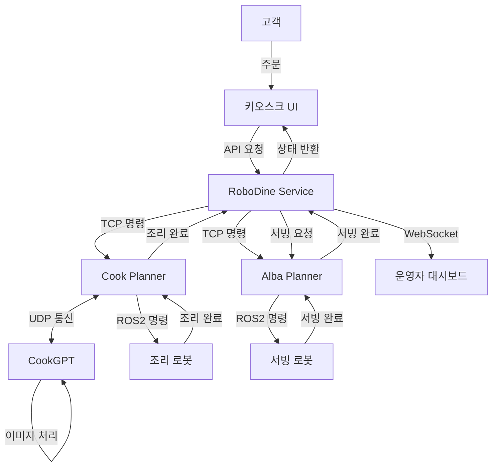

# 📂 RoboDine 프로젝트 구조

## 📌 프로젝트 개요

RoboDine은 로봇 기반 자동화 레스토랑 솔루션으로, 서빙 로봇(핑키)과 요리 로봇(myCobot280)을 통합해 고객 응대부터 음식 조리 및 서빙까지 레스토랑 운영의 전 과정을 자동화합니다. 본 문서는 전체 프로젝트의 구조와 각 모듈의 역할을 설명합니다.

## 📁 최상위 모듈 구조

| 모듈명 | 역할 |
|-------|------|
| **robodine_service** | 중앙 서버 및 프론트엔드 UI 시스템 |
| **alba_planner** | 서빙 로봇(핑키) 관리 시스템 |
| **cook_planner** | 조리 로봇(myCobot280) 관리 시스템 |
| **cook_gpt** | AI 기반 조리 지원 및 비전 처리 서비스 |
| **docs** | 프로젝트 문서 |

## 📂 상세 모듈 구성

### 1. robodine_service (중앙 서버 및 프론트엔드)

```
robodine_service/
├── backend/                # FastAPI 기반 백엔드 서버
│   ├── app/                # 애플리케이션 코어
│   │   ├── core/           # 설정 및 공통 모듈
│   │   ├── models/         # SQLModel 데이터 모델
│   │   ├── routes/         # API 엔드포인트
│   │   └── services/       # 비즈니스 로직
│   ├── run.py              # 애플리케이션 진입점
│   └── requirements.txt    # 의존성 패키지
│
└── frontend/               # 웹 인터페이스
    ├── operator/           # 운영자 대시보드 (React)
    │   ├── src/            # 소스 코드
    │   │   ├── components/ # React 컴포넌트
    │   │   ├── pages/      # 페이지 컴포넌트
    │   │   └── contexts/   # 상태 관리
    │   └── package.json    # 의존성 정의
    │
    └── kiosk/              # 고객용 키오스크 UI (React)
        ├── components/     # UI 컴포넌트
        └── pages/          # 페이지 컴포넌트
```

### 2. alba_planner (서빙 로봇 관리)

```
alba_planner/
└── alba_manager/
    ├── ros2_interface.py   # ROS2 통신 인터페이스
    ├── tcp_client.py       # 중앙 서버 통신
    ├── main.py             # 실행 진입점
    └── tests/              # 단위 테스트
```

### 3. cook_planner (조리 로봇 관리)

```
cook_planner/
└── cook_manager/
    ├── ros2_interface.py   # ROS2 통신 인터페이스
    ├── udp_interface.py    # CookGPT 통신
    ├── tcp_client.py       # 중앙 서버 통신
    ├── cooking_tasks.py    # 조리 작업 관리
    ├── main.py             # 실행 진입점
    └── tests/              # 단위 테스트
```

### 4. cook_gpt (AI 조리 지원)

```
cook_gpt/
└── cookgpt_service/
    ├── inference.py        # AI 조리 추론
    ├── udp_server.py       # UDP 통신 서버
    ├── object_detection.py # 음식 인식
    ├── pose_estimation.py  # 음식 위치/자세 추정
    ├── visual_servoing.py  # 로봇 위치 보정
    ├── main.py             # 실행 진입점
    └── tests/              # 단위 테스트
```

### 5. docs (프로젝트 문서)

```
docs/
├── architecture.md         # 시스템 아키텍처
├── fastapi_architecture.md # FastAPI 백엔드 구조
├── websocket_architecture.md # 웹소켓 통신 구조
├── network_communication.md  # 네트워크 통신 아키텍처
└── project_structure.md    # 프로젝트 구조 (본 문서)
```

## 🔄 데이터 흐름 및 모듈 간 통신

### 주요 통신 흐름



### 통신 프로토콜

| 연결 경로 | 프로토콜 | 포트 | 용도 |
|----------|---------|------|------|
| RoboDine Service ↔ Alba Planner | TCP | 8001 | 로봇 명령 및 상태 전송 |
| RoboDine Service ↔ Cook Planner | TCP | 8002 | 조리 명령 및 상태 전송 |
| CookGPT ↔ Cook Planner | UDP | 8003 | 비전 데이터 및 AI 추론 결과 |
| Frontend ↔ RoboDine Service | WebSocket | 3000 | 실시간 상태 업데이트 |
| Frontend ↔ RoboDine Service | HTTP/REST API | 8000 | CRUD 작업 및 인증 |

## 🛠️ 개발 기술 스택

### 백엔드 기술

- **Python 3.8+**: 주요 개발 언어
- **FastAPI**: REST API 및 웹소켓 서버
- **SQLModel**: ORM (Object-Relational Mapping)
- **Socket.io**: 웹소켓 통신
- **ROS2 Jazzy**: 로봇 운영 시스템
- **OpenCV**: 컴퓨터 비전 처리
- **PyTorch**: AI 추론 엔진

### 프론트엔드 기술

- **React**: UI 라이브러리
- **Tailwind CSS**: 스타일링
- **Axios**: HTTP 클라이언트
- **React Router**: 라우팅
- **Socket.io-client**: 웹소켓 클라이언트
- **Chart.js**: 데이터 시각화

### 인프라 및 도구

- **Docker**: 컨테이너화
- **pytest**: 파이썬 테스트
- **Jest**: JavaScript 테스트
- **GitHub Actions**: CI/CD 파이프라인

## 💾 데이터베이스 스키마 개요

RoboDine 서비스는 SQLite를 사용하며, 주요 데이터 모델은 다음과 같습니다:

- **Robot**: 로봇 정보 및 상태
- **Order**: 주문 정보
- **Table**: 테이블 정보
- **Customer**: 고객 정보
- **Inventory**: 재고 관리
- **Event**: 시스템 이벤트
- **User**: 관리자 계정
