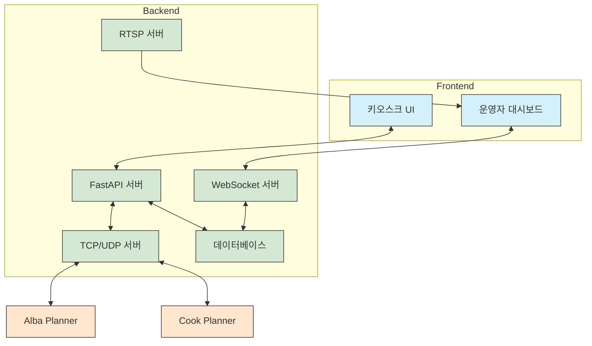

# 🚀 RoboDine 서비스

    

## 📌 개요

RoboDine 서비스는 로봇 자동화 레스토랑의 중추적인 중앙 시스템으로, 백엔드 API 서버와 프론트엔드 애플리케이션을 통합한 완전한 서비스 솔루션입니다. 이 시스템은 로봇 제어, 주문 관리, 재고 추적, 사용자 인터페이스를 아우르는 종합적인 플랫폼을 제공합니다.

## 🏛️ 구성 요소

RoboDine 서비스는 두 가지 주요 구성 요소로 이루어져 있습니다:

### 1. [백엔드 서비스](backend)

FastAPI 기반의 강력한 백엔드 시스템으로, 다음과 같은 핵심 기능을 제공합니다:
- REST API 서버
- WebSocket 실시간 통신
- 로봇 제어 인터페이스 (TCP/UDP)
- 데이터 관리 및 비즈니스 로직
- 실시간 비디오 스트리밍 (RTSP)

[백엔드 서비스 문서 바로가기](backend/README.md)

### 2. [프론트엔드 시스템](frontend)

React.js 기반의 사용자 인터페이스 시스템으로, 다음과 같은 애플리케이션을 포함합니다:
- [운영자 대시보드](frontend/operator) - 매장 모니터링 및 관리 인터페이스
- [키오스크 시스템](frontend/kiosk) - 고객 주문 인터페이스

[프론트엔드 시스템 문서 바로가기](frontend/README.md)

## 🔄 시스템 통합 아키텍처

RoboDine 서비스는 다양한 구성 요소 간의 원활한 통신을 위한 복합적인 아키텍처를 채택하고 있습니다:



## 📊 데이터 흐름

RoboDine 서비스 내에서의 데이터 흐름은 다음과 같습니다:

1. **고객 주문 프로세스**:
   - 키오스크 UI → REST API → 백엔드 서버 → 데이터베이스
   - 백엔드 서버 → WebSocket → 운영자 대시보드 (실시간 알림)
   - 백엔드 서버 → TCP → Cook Planner (조리 지시)

2. **로봇 상태 모니터링**:
   - 로봇 → TCP → 백엔드 서버 → 데이터베이스
   - 백엔드 서버 → WebSocket → 운영자 대시보드 (실시간 상태)
   - 로봇 카메라 → RTSP → 백엔드 RTSP 서버 → 운영자 대시보드

3. **재고 관리**:
   - 운영자 대시보드 → REST API → 백엔드 서버 → 데이터베이스
   - 자동 재고 감소: 주문 → 백엔드 서버 → 데이터베이스

## 🚀 서비스 실행 방법

### 전체 시스템 실행

전체 RoboDine 서비스를 한 번에 실행하려면 다음 명령을 사용하세요:

```bash
# 백엔드 서버 실행
cd backend
python run.py &

# 프론트엔드 서버 실행
cd ../frontend/operator
npm run dev &

cd ../kiosk
npm run dev &
```

### Docker를 이용한 실행

Docker Compose를 이용하여 전체 시스템을 컨테이너화하여 실행할 수 있습니다:

```bash
docker-compose up -d
```

## 🔗 외부 시스템 연결

RoboDine 서비스는 다음과 같은 외부 시스템과의 인터페이스를 제공합니다:

| 시스템 | 연결 프로토콜 | 포트 | 용도 |
|--------|--------------|------|------|
| [Alba Planner](../alba_planner) | TCP | 8001 | 서빙 로봇 제어 및 상태 모니터링 |
| [Cook Planner](../cook_planner) | TCP | 8002 | 조리 로봇 제어 및 상태 모니터링 |
| [CookGPT](../cook_gpt) | TCP | 8003 | AI 조리 지원 및 비전 처리 |

## 📚 관련 문서

RoboDine 서비스에 대한 자세한 이해를 위해 다음 문서를 참조하세요:

- [전체 시스템 아키텍처](../docs/architecture.md)
- [FastAPI 백엔드 아키텍처](../docs/fastapi_architecture.md)
- [WebSocket 통신 아키텍처](../docs/websocket_architecture.md)
- [네트워크 통신 방식](../docs/network_communication.md)
- [프로젝트 구조](../docs/project_structure.md)

## 📌 개발 환경 설정

### 필수 요구사항

- Python 3.8+
- Node.js 14+
- npm 6+
- SQLite 3.36+

### 개발 환경 구성

1. 저장소 클론:
   ```bash
   git clone https://github.com/yourusername/robodine-project.git
   cd robodine-project/robodine_service
   ```

2. 백엔드 설정:
   ```bash
   cd backend
   python -m venv venv
   source venv/bin/activate  # Windows: venv\Scripts\activate
   pip install -r requirements.txt
   ```

3. 프론트엔드 설정:
   ```bash
   cd ../frontend/operator
   npm install
   
   cd ../kiosk
   npm install
   ```

## 📊 성능 모니터링

RoboDine 서비스는 다양한 방법으로 시스템 성능을 모니터링합니다:

- **로그 분석**: 구조화된 로깅 시스템을 통한 트렌드 분석
- **API 응답 시간**: 엔드포인트별 성능 추적
- **실시간 메트릭**: CPU, 메모리, 네트워크 사용량 모니터링
- **데이터베이스 성능**: 쿼리 실행 시간 및 연결 상태 추적

## 🚀 확장성 계획

RoboDine 서비스는A 다음과 같은 확장 계획을 가지고 있습니다:

- **멀티 레스토랑 지원**: 여러 매장을 관리할 수 있는 시스템으로 확장
- **마이크로서비스 아키텍처**: 서비스를 독립적인 마이크로서비스로 분리
- **클라우드 네이티브**: Kubernetes 기반 컨테이너 오케스트레이션 도입
- **고급 분석**: 빅데이터 분석 도구를 통한 비즈니스 인사이트 제공 