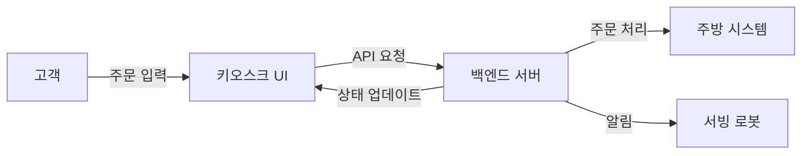

# 🖥️ RoboDine 키오스크 시스템

## 📌 개요

RoboDine 키오스크는 로봇 레스토랑의 주문 프로세스를 디지털화한 고객 주문 인터페이스입니다. 직관적인 UI와 반응형 디자인으로 고객이 쉽게 메뉴를 탐색하고 주문할 수 있도록 설계되었습니다.

## 🚀 주요 기능

- **직관적인 메뉴 탐색**: 카테고리별 정렬 및 이미지 기반 메뉴 탐색
- **커스텀 주문**: 메뉴 수량 조절 및 옵션 선택 기능
- **실시간 주문 상태**: WebSocket을 통한 주문 상태 실시간 업데이트
- **결제 시스템 통합**: 다양한 결제 방식 지원
- **테이블 연동**: QR 코드 또는 테이블 번호를 통한 주문-테이블 연동
- **다국어 지원**: 한국어/영어 언어 전환 지원

## 🎨 UI/UX 특징

- **반응형 디자인**: 다양한 화면 크기에 최적화된 인터페이스
- **접근성 중심**: 직관적인 아이콘과 명확한 텍스트 사용
- **터치 최적화**: 큰 버튼과 간결한 인터랙션 구조
- **시각적 피드백**: 사용자 액션에 즉각적인 피드백 제공
- **간결한 주문 흐름**: 3단계 이내로 주문 완료 가능한 프로세스

## 🛠️ 기술 스택

- **프론트엔드**: React.js, Tailwind CSS
- **상태 관리**: Context API
- **통신**: Axios, WebSocket
- **UI 라이브러리**: React Icons, Framer Motion

## 📊 시스템 구성도



## 🔄 주문 처리 흐름

1. **메뉴 선택**: 고객이 카테고리를 탐색하고 메뉴 선택
2. **옵션 및 수량 조정**: 필요한 옵션 선택 및 수량 조정
3. **주문 확인**: 선택한 메뉴 및 총액 확인
4. **결제 진행**: 다양한 결제 수단으로 주문 완료
5. **주문 확인**: 주문 번호 및 예상 제공 시간 안내
6. **실시간 업데이트**: 주문 상태 변경 시 알림 제공

## 📂 코드 구조

```
kiosk/
├── components/        # 재사용 가능한 UI 컴포넌트
│   ├── MenuCard.jsx   # 메뉴 카드 컴포넌트
│   ├── CartItem.jsx   # 장바구니 아이템 컴포넌트
│   └── ...
├── pages/             # 주요 페이지 컴포넌트
│   ├── MainMenu.jsx   # 메인 메뉴 페이지
│   ├── OrderCart.jsx  # 장바구니 페이지
│   └── Payment.jsx    # 결제 페이지
├── contexts/          # 상태 관리 컨텍스트
│   └── OrderContext.js
├── services/          # API 통신 로직
│   └── apiService.js
├── hooks/             # 커스텀 훅
│   └── useOrder.js
├── utils/             # 유틸리티 함수
│   └── formatter.js   # 가격, 날짜 등 포맷팅
└── index.html         # 진입점
```

## 🔌 백엔드 연동

키오스크는 다음과 같은 API를 통해 RoboDine 백엔드와 통신합니다:

- `GET /api/menu`: 메뉴 목록 조회
- `POST /api/orders`: 새로운 주문 생성
- `GET /api/orders/{id}`: 주문 상태 조회
- `WS /ws/orders`: 주문 상태 실시간 업데이트

## 🚀 미래 개선 계획

- **AI 기반 메뉴 추천**: 사용자 주문 이력 기반 개인화된 추천
- **음성 인식 주문**: 장애인 접근성 향상을 위한 음성 인터페이스