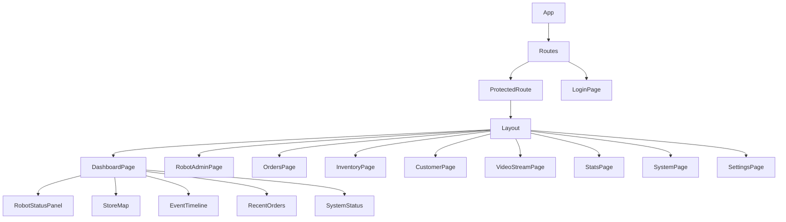
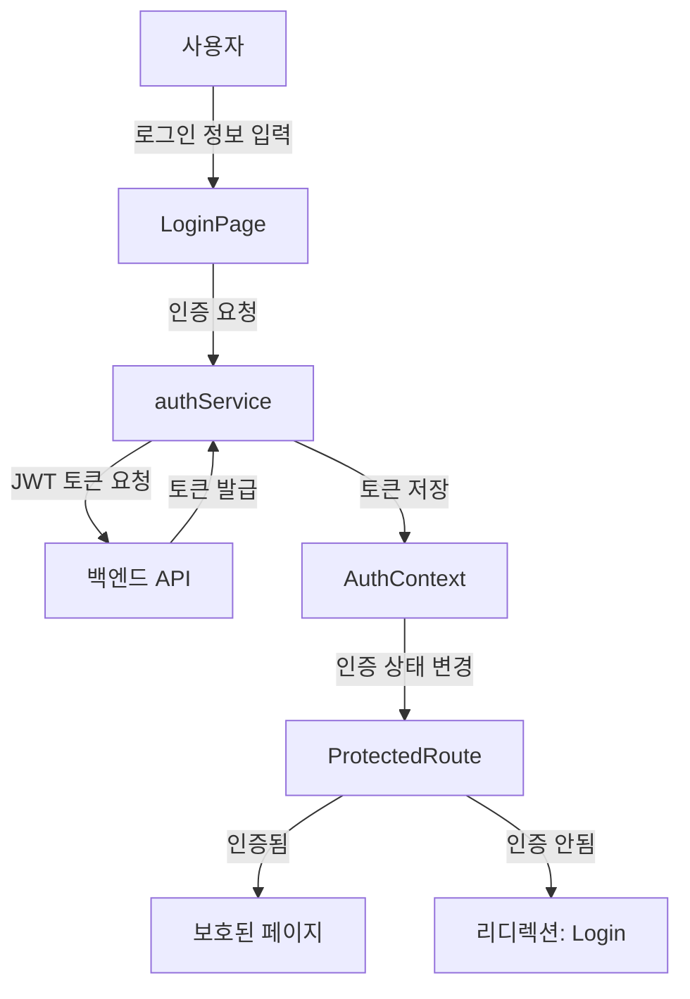
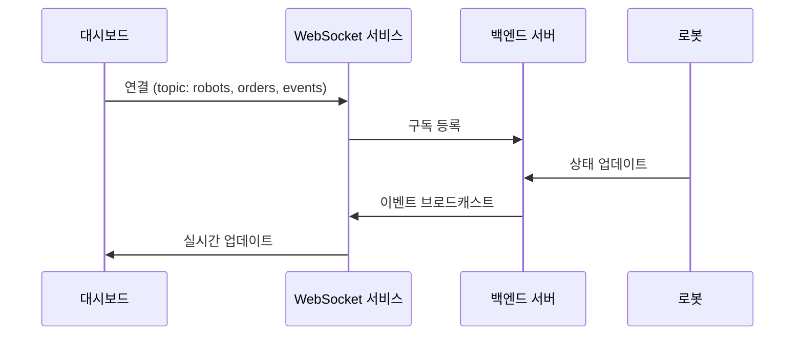
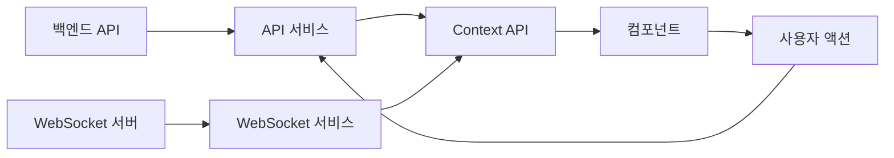

# 🖥️ RoboDine 운영자 대시보드

## 📌 개요

RoboDine 운영자 대시보드는 로봇 레스토랑의 전체 운영을 위한 중앙 관제 시스템입니다. 로봇 상태 모니터링, 주문 관리, 매장 관리, 재고 관리 등 레스토랑 운영에 필요한 모든 기능을 통합된 웹 인터페이스로 제공합니다.


## 🚀 주요 기능

- **실시간 로봇 상태 모니터링**: 각 로봇의 위치, 배터리 상태, 동작 상태 관제
- **주문 관리 시스템**: 주문 접수, 상태 변경 및 이력 조회
- **매장 맵**: 테이블과 로봇의 실시간 위치 시각화
- **이벤트 모니터링**: 시스템 이벤트 실시간 추적 및 알림
- **재고 관리**: 실시간 재고 현황 및 자동 발주 설정
- **비디오 스트리밍**: 녹화된 로봇 카메라 및 매장 CCTV 모니터링
- **분석 대시보드**: 매출, 고객 데이터 분석 및 시각화
- **설정 및 시스템 관리**: 시스템 파라미터 및 사용자 권한 관리

## 💡 기술적 특징

- **WebSocket 기반 실시간 업데이트**: 백엔드 이벤트 즉시 반영
- **반응형 레이아웃**: 데스크톱부터 태블릿까지 다양한 화면 크기 지원
- **컴포넌트 기반 설계**: 재사용 가능한 React 컴포넌트로 구성
- **토큰 기반 인증**: JWT를 활용한 안전한 사용자 인증
- **상태 관리 최적화**: React Context API를 활용한 상태 관리
- **차트 및 데이터 시각화**: 직관적인 데이터 시각화 도구 활용
- **보호된 라우팅**: 인증된 사용자만 접근 가능한 보안 구조

## 🛠️ 기술 스택

- **프론트엔드**: React.js, Tailwind CSS
- **차트 및 데이터 시각화**: Chart.js, D3.js
- **지도 및 위치 시각화**: react-map-gl
- **실시간 통신**: WebSocket
- **HTTP 클라이언트**: Axios
- **인증**: JWT
- **라우팅**: React Router v6

## 📊 애플리케이션 구조 및 라우팅

대시보드는 다음과 같은 페이지 구조로 구성되어 있습니다:

| 경로 | 페이지 컴포넌트 | 설명 |
|------|--------------|------|
| `/` | `DashboardPage` | 메인 대시보드 (종합 상황판) |
| `/login` | `LoginPage` | 로그인 화면 (비인증 접근 가능) |
| `/orders` | `OrdersPage` | 주문 관리 및 추적 |
| `/customers` | `CustomerPage` | 고객 및 테이블 관리 |
| `/stats` | `StatsPage` | 통계 및 데이터 분석 |
| `/system` | `SystemPage` | 시스템 이벤트 및 로그 |
| `/settings` | `SettingsPage` | 시스템 설정 관리 |
| `/robots` | `RobotAdminPage` | 로봇 관리 및 제어 |
| `/video-stream` | `VideoStreamPage` | 비디오 스트리밍 관리 |
| `/inventory` | `InventoryPage` | 재고 관리 시스템 |

모든 경로(로그인 페이지 제외)는 `ProtectedRoute` 컴포넌트로 보호되어 인증된 사용자만 접근 가능합니다.

## 📊 주요 페이지 기능

### 1. 메인 대시보드 (DashboardPage)

- **로봇 상태 패널**: 모든 로봇의 실시간 상태 표시
- **매장 맵**: 테이블과 로봇의 실시간 위치 시각화
- **최근 주문**: 최신 주문 내역 및 상태
- **시스템 상태**: 주요 시스템 구성 요소 상태 표시
- **이벤트 타임라인**: 중요 이벤트 실시간 표시

### 2. 로봇 관리 (RobotAdminPage)

- **로봇 목록**: 모든 로봇의 상세 정보 및 상태
- **로봇 제어**: 원격 명령 전송 및 설정 변경
- **작업 이력**: 로봇별 작업 및 이동 이력
- **유지보수**: 로봇 정비 일정 및 이력 관리

### 3. 주문 관리 (OrdersPage)

- **주문 대시보드**: 현재 활성화된 모든 주문 관리
- **주문 상태 변경**: 주문 상태 업데이트 및 처리
- **주문 이력**: 과거 주문 내역 및 검색
- **주문 상세 정보**: 각 주문의 상세 내용 및 메뉴 확인

### 4. 고객 및 테이블 관리 (CustomerPage)

- **테이블 상태**: 현재 테이블 사용 상황 모니터링
- **고객 관리**: 현재 매장 내 고객 정보 관리
- **테이블 할당**: 고객 그룹에 테이블 할당 기능
- **대기 관리**: 대기 고객 목록 및 알림

### 5. 재고 관리 (InventoryPage)

- **재고 현황**: 실시간 재고 수준 모니터링
- **부족 재고 알림**: 임계치 이하 재고 표시
- **발주 관리**: 자동 및 수동 발주 시스템
- **사용량 추적**: 재료별 사용량 분석

### 6. 비디오 스트리밍 (VideoStreamPage)

- **실시간 모니터링**: 로봇 카메라 및 매장 CCTV 영상
- **녹화 관리**: 녹화 영상 검색 및 재생
- **이벤트 연동**: 특정 이벤트 발생 시 관련 영상 확인
- **카메라 설정**: 카메라 각도 및 설정 관리

### 7. 통계 및 분석 (StatsPage)

- **매출 대시보드**: 일별/주별/월별 매출 추이
- **인기 메뉴**: 주문량 기준 메뉴 랭킹
- **피크 타임**: 시간대별 주문량 분석
- **고객 분석**: 방문 패턴 및 선호도 분석


### 8. 설정 (SettingsPage)

- **사용자 관리**: 직원 계정 및 권한 설정
- **시스템 설정**: 운영 시간, 알림 설정 등
- **백업 및 복원**: 데이터 백업 및 복원 관리


## 🔄 데이터 흐름

### React 컴포넌트 구조



### 인증 흐름



### WebSocket 통신 구조



### 상태 관리 흐름



## 📊 주요 컴포넌트 설명

### 로봇 상태 패널 (RobotStatusPanel)

로봇의 현재 상태를 직관적으로 표시하는 대시보드 컴포넌트:
- 배터리 수준 시각화 (색상 코드 및 퍼센트)
- 현재 작업 상태 표시 (대기, 이동 중, 서빙 중, 충전 중, 오류)
- 로봇 유형별 아이콘 및 색상 구분 (서빙 로봇, 조리 로봇)
- 마지막 통신 시간 및 연결 상태 표시
- 상세 정보 팝업 제공 (로봇 ID, MAC 주소, IP 주소)

### 매장 맵 (StoreMap)

매장의 테이블과 로봇 위치를 실시간으로 시각화:
- 확대/축소 가능한 인터랙티브 맵
- 테이블 상태(빈 테이블/사용 중/예약됨) 색상 구분
- 로봇 실시간 위치 추적 및 이동 경로 표시

### 이벤트 타임라인 (EventTimeline)

시스템 이벤트를 시간순으로 표시:
- 이벤트 유형별 필터링 (로봇, 주문, 시스템, 고객, 비상)
- 심각도에 따른 색상 구분 (정보, 경고, 오류, 중요)
- 타임라인 형식의 시각적 표현
- 실시간 업데이트 및 알림

### 주문 관리 (OrderManagement)

주문 처리 및 추적을 위한 기능:
- 현재 주문 상태 실시간 모니터링
- 주문 상태 변경 (접수, 준비 중, 서빙 중, 완료, 취소)
- 테이블별/고객별 주문 필터링
- 주문 상세 정보 조회 (메뉴, 수량, 가격)
- 주문 이력 조회 및 검색

### 인증 및 권한 관리 (AuthContext)

사용자 인증 및 권한 관리:
- JWT 기반 인증 관리
- 보호된 라우트 처리
- 자동 로그인 및 세션 유지
- 권한별 기능 접근 제어
- 타임아웃 및 자동 로그아웃

## 📃 문제 해결

### 자주 발생하는 문제

1. **웹소켓 연결 끊김 현상**
   - 해결책: 자동 재연결 메커니즘 확인 및 네트워크 상태 점검

2. **데이터 지연 문제**
   - 해결책: 폴링 간격 조정 및 백엔드 성능 최적화

3. **차트 렌더링 성능 저하**
   - 해결책: 데이터 포인트 수 제한 및 메모이제이션 활용

### 성능 최적화

- React.memo()를 활용한 불필요한 리렌더링 방지
- 중요 데이터 캐싱 및 로컬 스토리지 활용

## 📱 스크린샷

### 메인 대시보드


### 영상 스트리밍

### 로봇 관리 화면

### 고객, 테이블 관리 화면

### 주문 관리 화면

### 재고 관리 화면

### 설정 화면


## 📂 코드 구조

```
operator/
├── public/              # 정적 파일
├── __tests__/           # 테스트 파일
├── src/                 # 소스 코드
│   ├── components/      # 재사용 가능한 컴포넌트
│   │   ├── dashboard/   # 대시보드 관련 컴포넌트
│   │   │   ├── RobotStatusPanel.jsx  # 로봇 상태 패널
│   │   │   ├── StoreMap.jsx          # 매장 맵
│   │   │   ├── EventTimeline.jsx     # 이벤트 타임라인
│   │   │   ├── RobotDetailModal.jsx  # 로봇 상세 정보 모달
│   │   │   ├── RecentOrders.jsx      # 최근 주문
│   │   │   └── SystemStatus.jsx      # 시스템 상태
│   │   ├── customer/    # 고객 관련 컴포넌트
│   │   ├── Layout.jsx   # 메인 레이아웃 컴포넌트
│   │   └── AuthLayout.jsx # 인증 페이지 레이아웃
│   ├── contexts/        # React 컨텍스트 (상태 관리)
│   │   ├── AuthContext.jsx        # 인증 관련 상태
│   │   ├── WebSocketContext.jsx   # 웹소켓 연결 관리
│   │   ├── HealthCheckContext.jsx # 시스템 상태 체크
│   │   └── NotificationsContext.jsx # 알림 관리
│   ├── pages/           # 페이지 컴포넌트
│   │   ├── auth/        # 인증 관련 페이지
│   │   ├── DashboardPage.jsx     # 메인 대시보드
│   │   ├── LoginPage.jsx         # 로그인 화면
│   │   ├── SignupPage.jsx        # 회원가입 화면
│   │   ├── RobotAdminPage.jsx    # 로봇 관리
│   │   ├── OrdersPage.jsx        # 주문 관리
│   │   ├── InventoryPage.jsx     # 재고 관리
│   │   ├── CustomerPage.jsx      # 고객/테이블 관리
│   │   ├── VideoStreamPage.jsx   # 영상 스트리밍
│   │   ├── StatsPage.jsx         # 통계 및 분석
│   │   ├── SystemPage.jsx        # 시스템 관리
│   │   └── SettingsPage.jsx      # 설정
│   ├── services/        # API 서비스
│   │   └── api.js       # API 클라이언트 설정
│   ├── config/          # 설정 파일
│   │   └── api.js       # API 엔드포인트 설정
│   ├── styles/          # 스타일 관련 파일
│   ├── App.jsx          # 앱 진입점 및 라우팅
│   ├── index.jsx        # React 렌더링
│   └── index.css        # 전역 스타일
├── package.json         # 프로젝트 의존성 및 스크립트
├── package-lock.json    # 의존성 버전 관리
└── tailwind.config.js   # Tailwind CSS 설정
```